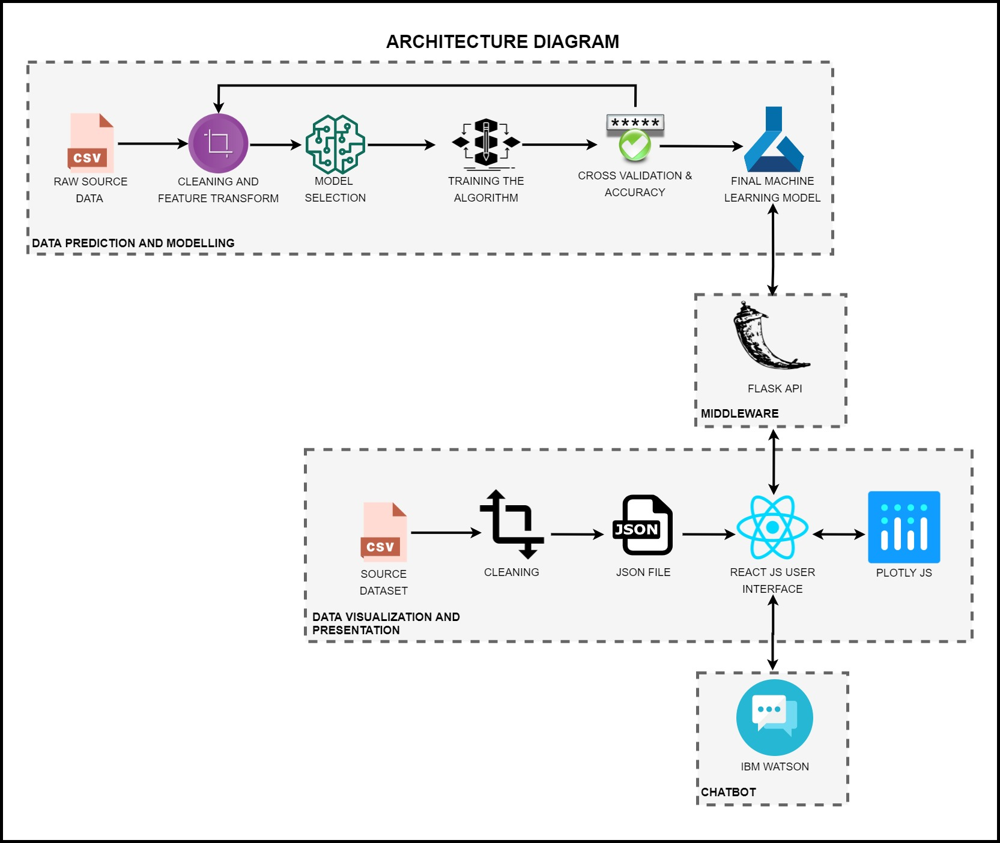

# FuelSense
A SVM based fuel economy analysis tool

## Abstract
Modern automotive companies spend large sums of money trying to meet government-regulated standards for fuel-efficiency. Finding optimal conditions for an existing design to be tested under is far cheaper than redesigning an engine for higher efficiency. By creating predictive software capable of estimating the conditions of optimal function, car corporations could save substantial amounts of money on redesigns.
 
Because accurate predictions need to be made with a relatively small dataset, neural nets are unlikely to be effective for this task. Instead, due to the consistency and cleanliness of our data, we believe Support Vector Machines will be highly effective at building a predictive model.
 
Additionally, because Support Vector Machine predictions are relatively fast compared to neural nets, a brute force approach can be used for approximating optimal values for missing variables.

## Project Idea Description 
The Corporate Average Fuel Economy (CAFE) standards set by the Secretary of Transportation and EPA regulation require all new vehicles to meet a certain fuel efficiency standard. The current automotive industry heavily relies on statistics such as fuel economy to effectively market their product and to determine product feasibility for their future products.
 
Our project aims to create an application that will enable the manufacturers to analyze mileage for different types of fuels and road conditions. The application will be able to set various parameters and predict the mileage for a fuel type in different conditions. This will help the enterprise in marketing their products and obtaining approval from the EPA.

#### Data Source  
https://www.kaggle.com/anderas/car-consume#measurements.csv
 
 
## Goal of the project
Use Support Vector Machines to evaluate the best fuel economy for different fuel types considering a variety of environmental factors and road conditions.

## Hill Statement 

> *Who: Automotive manufactures* 

> *What: To gauge analyze the effect of various environmental factors and road conditions on an automotive engine fuel efficiency*

> *WoW Factor: A manufacturer independent analytical tool working with a small input dataset to determine optimal testing condtion for an automtoive engine*

## Architecture Diagram

## Deployment Schema

## Technology Stack
- React
- Plotly.js
- Flask
- Python - scikit-learn, NumPy, Pandas, PyPI
- Docker
- Amazon AWS – ECS, ECR, EC2

## Team Members
1. Dimitrie Milinovich
2. Pranav Karmalkar
3. Ritu Singh
4. Swapnil Parihar
